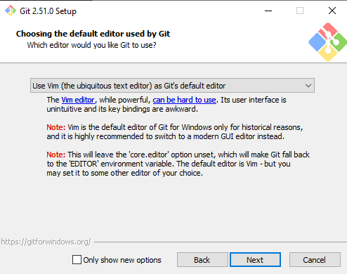
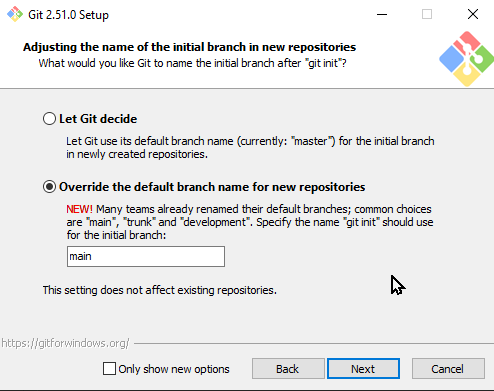
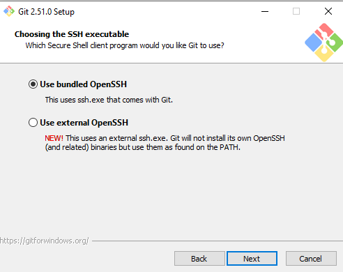
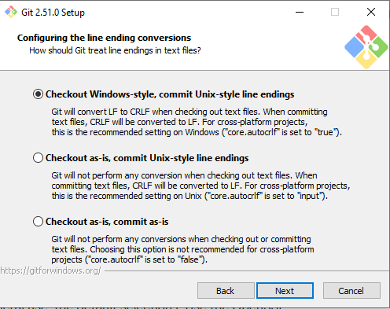
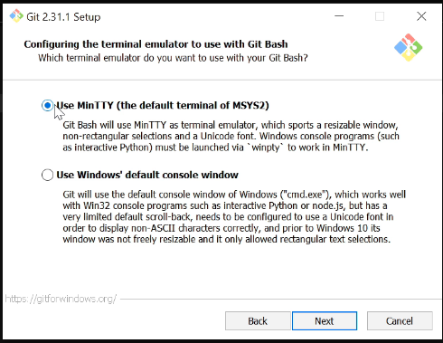
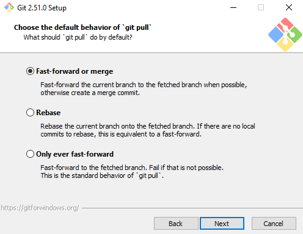
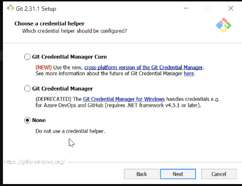
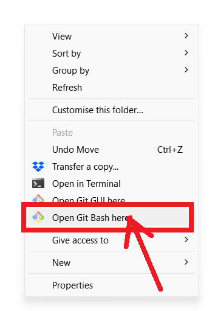
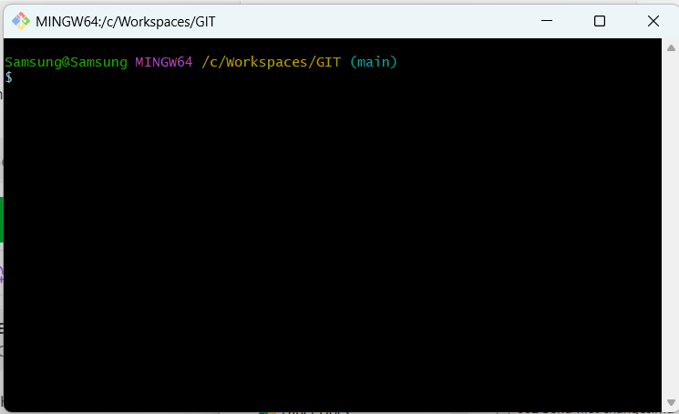

# Install Git on Windows
- First check if it's already installed
- Type this command on Windows Powershell
- git --version
- 
- If Powershell shows you some version that means it's already installed, but if it shows something like this image below, continue with the installation
- 
- Download Git
- https://git-scm.com/downloads
- On the first installation window, choose NONE, you don't want a credential helper
- Unmark the option for graphical interface
-  
- If you already use VS Code, Notepad or another modern editor, choose it, Vim is frustrating for beginners.

- Select override the default branch name for new repositories and use "main" 

- Choose Git from the command line and also from 3rd-party software (like VSCode)
- 
- Select "Use bundled OpenSSH" so that Git has everything it needs to function correctly
- 
- Select "OpenSSL library", you should only choose "Use the native Windows Secure Channel library" if you are in a corporate or managed environment where you know that your organization's internal certificates 
- 
- Select "Checkout Windows-style, commit Unix-style line endings" because you're running Windows.
- 
- Use MinTTY
- 
- Select "Fast-forward or merge" if you're not very experienced
- 

- For a standard, general-purpose installation, the best choice is to leave "Enable file system caching" checked and leave "Enable symbolic links" unchecked unless you have a specific need for them.
- 
- Choose NONE for credential manager
- 
- Once installed, when you right-click on any folder in Windows File Explorer, the "Git Bash here" option should appear in the context menu.
- 
- By choosing Git Bash, you'll open the terminal to type Git commands
- 