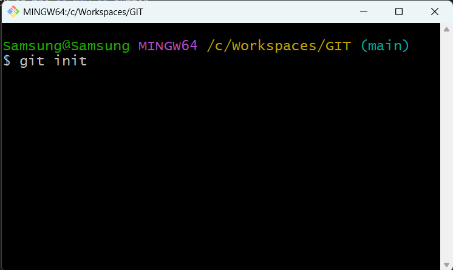

# On Windows Explorer:
- On Windows **File Explorer** create the folder that will be handled by Git
- Right-click and choose open with Git Bash
- On Git Bash terminal type **"git int"**

# On Github
- Click on the cat icon, this will take you to the main menu
- Click on the **"New"** button to start creating the repository
- Give the repository a name and click on the button "Create repository" below
- Copy the SSH address (you'll it later on Git Bash) and the commands 
  
# On Git Bash Terminal
- Type the commands:
- git add README.md
- git commit -m "Your message"
- git branch -M main
- git remote add origin SSH-address
- git push -u origin main 