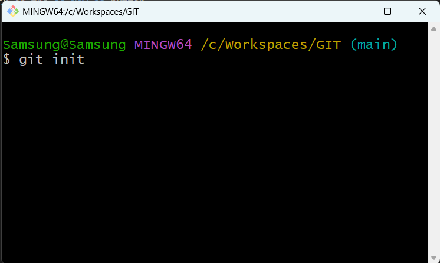

# On Windows Explorer:
- On Windows **File Explorer** create the folder that will be handled by Git
- Right-click and choose open with Git Bash
- On Git Bash terminal type **"git int"**

# On Github
- Click on the cat icon, this will take you to the main menu

- Click on the **"New"** button