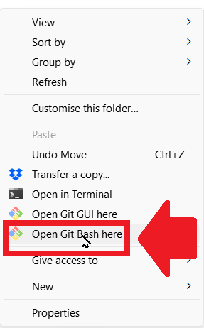

# Configure Git user
- Configure your Git user on your machine
- Open the Git Bash terminal (Right-click and choose this from menu)
- 
- Type the first command
- git config --global user.name "Your name"
- Type the second command
- git config --global user.email "youremail@email.com"