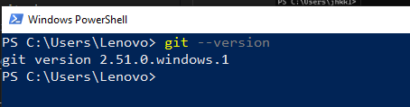
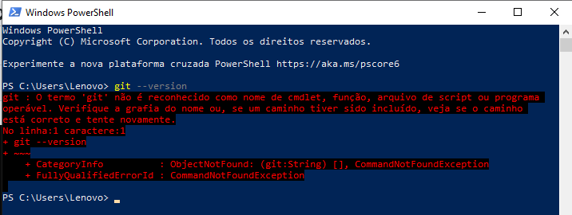
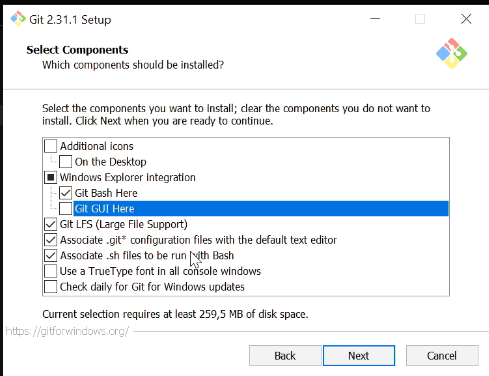
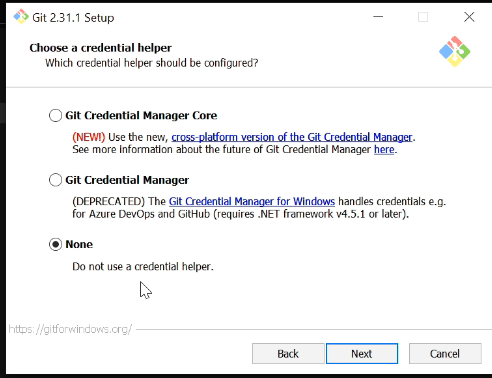

# Install Git on Windows 11
- First check if it's already installed
- Type this command on Windows Powershell
- git --version
- 
- If Powershell shows you some version that means it's already installed, but if it shows something like this image below, continue with the installation
- 
- Download Git
- https://git-scm.com/downloads
- On the first installation window, choose NONE, we don't want a credential helper
- Unmark the option for graphical interface
-  
- Override the default branch name with "main"
- Choose Git from the command line and also from 3rd-party software (like VSCode)
- 
- Use MinTTY
- 
- Choose NONE for credential manager
- 
- Once installed, when you right-click on any folder in Windows File Explorer, the "Git Bash here" option should appear in the context menu.
- 
- By choosing Git Bash, you'll open the terminal to type Git commands
- 