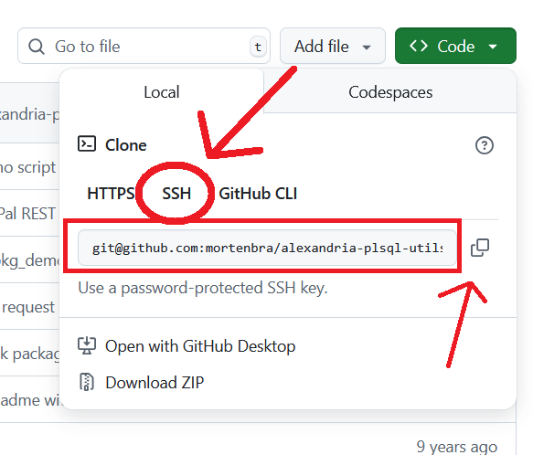
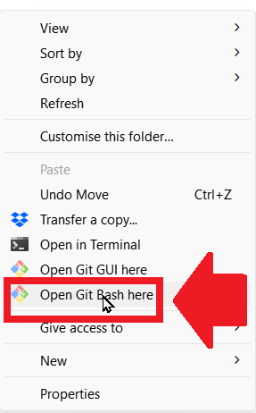
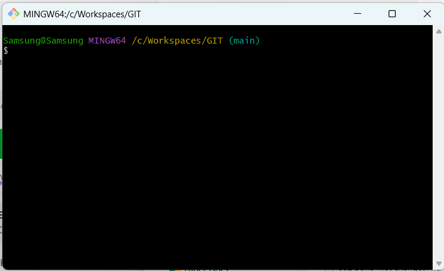
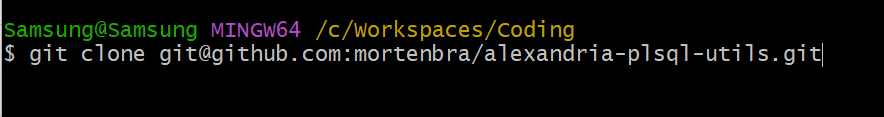

# Clone a project
- First go to Github and copy the SSH address of the repository you want to clone.
- 
- Then go back to Windows Explorer and open(or create) the folder that you want to version with Git.
- Right-click inside this folder and choose open Git Bash
- 
- You'll see the Git Bash terminal
- 
- Type the command "git clone" followed by the SSH address you copied previously
- git clone SSH address
- Example:
- 
  
# Push changes
- Now add files to this folder and send them to Github by typing the commands below
- git add .
- git commit -m "Write a message of what you did to the folder"
- git push

# Clone vs Pull

Cloning and pulling are two distinct Git commands used to manage code in a repository, but they serve different purposes.1
- git clone is used to create an initial, complete local copy of a remote repository.2 Think of it as downloading the entire project for the first time. It copies all branches, files, and the full commit history, creating a new local repository on your machine.3 You only need to clone a repository once.4
---

# git clone

- Purpose: To get a repository for the first time.5
- What it does: Downloads the entire project, including all files and the complete commit history, and creates a new local repository on your machine.6
- When to use it: When you're starting to work on a project and don't have a local copy of the repository yet.7
- Analogy: It's like downloading a brand-new game you've never played before. You get all the files and data to start from the very beginning.8
---

# git pull

- Purpose: To update an existing local repository with the latest changes from the remote repository.9
- What it does: It's a combination of two commands: git fetch (which downloads changes from the remote without integrating them) and git merge (which integrates the downloaded changes into your current local branch).10
- When to use it: When you already have a local copy of the repository and want to get the latest changes that your collaborators have pushed.11
- Analogy: It's like installing a patch or update for a game you already have. You're just getting the new content, not re-downloading the entire game.