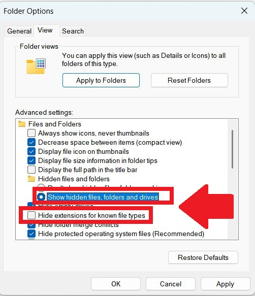
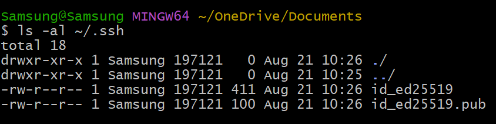
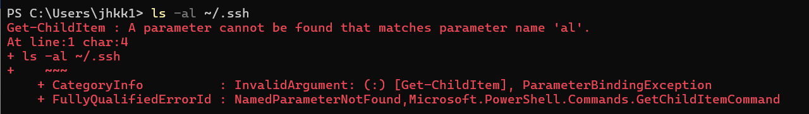
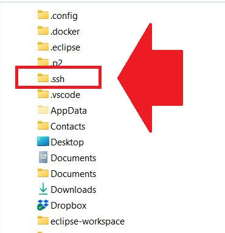
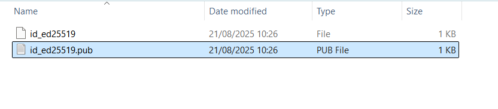
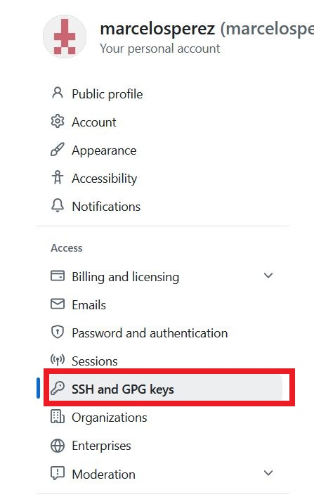

# Connect your machine to Github
- First, you need to show hidden files and Windows extensions:
- 
- To connect with Github you need to generate an SSH key in your machine
- First check if one already exists
- Open the Windows Powershell terminal and type this command
- ls -al ~/.ssh
- If the key already exists, you'll see something like this:
- 
- If the key was not yet generated, you'll see something like this:
- 
- To generate the SSH in your machine type the following command followed by your Github email:
- ssh-keygen -t ed25519 -C "yourgithubemail@gmail.com"
- You can just click ENTER for all suggestions and accept the standard values
- Now go to the folder where the key was generated, on Windows it's the C:\Users\your_user_name
- 
- Open the file .epub on your Notepad
- 
- This is the number you'll use connect your machine with Github and sync your files
- So, now you need to go to Github
- Click the logo for your account
- Then settings
- and then on SSH and GPG keys (on the left)
- 
- Click the button "New SSH key"
- 
- Now paste the key that you opened on your Notepad and click on "Add SSH key"
- That's it, now go to the next step where you'll learn how to sync a folder with Github