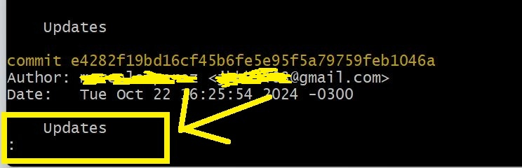

# Check the previous state of a file
- Use the command "git checkout" followed by a past hash code to check the previous state of a file or folder:
- git checkout  65ecca8f2f9d3cbe806b6ad909d0aa45321588ee
- This way we're moving the HEAD pointer to a past state. You have to be very careful, you don't want save any changes
- To go back to the current state type:
- git checkout main
- This view in the image below is read-only and is designed for browsing only, NOT for typing commands. The colon indicates the end of the content displayed on the screen. To exit this view and return to the command line, you need to type the letter q
- 
